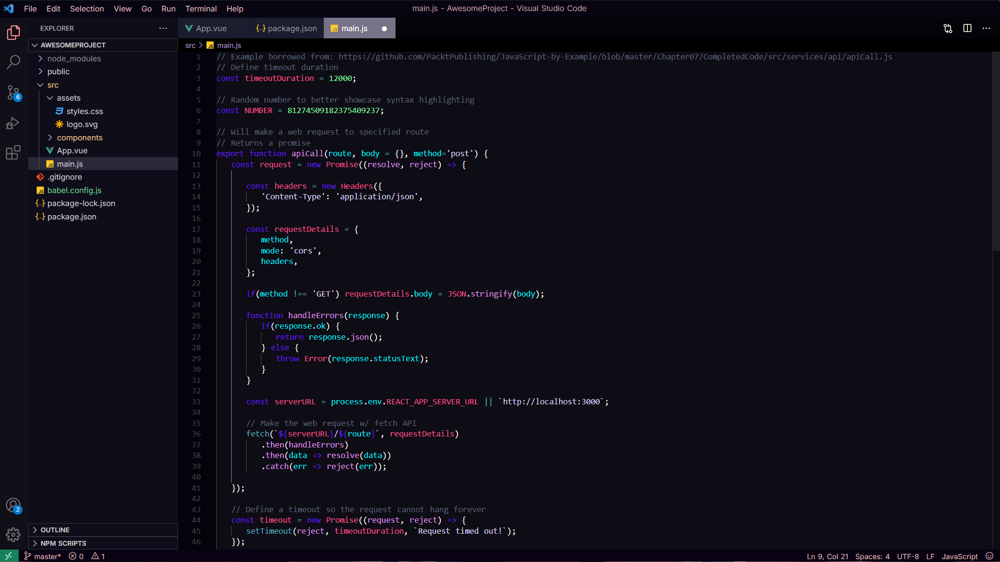

# My Theme

A clean, atmospheric VS Code theme designed around soft colors and comfortable contrast.

## Preview

## Features

- Custom dark color palette
- Soft lavender accents
- Carefully tuned syntax highlighting
- Designed for long coding sessions

## Installation

1. Open **Extensions** in VS Code.
2. Search for **Sekr's theme**.
3. Click **Install**.
4. Open the Command Palette with `Ctrl+Shift+P`.
5. Select **Preferences: Color Theme**.
6. Choose **My Theme**.

## Feedback

If you find a bug or have a suggestion, feel free to open an issue.